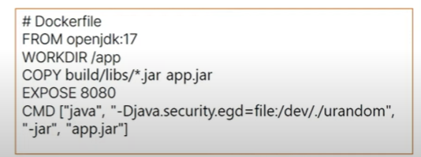
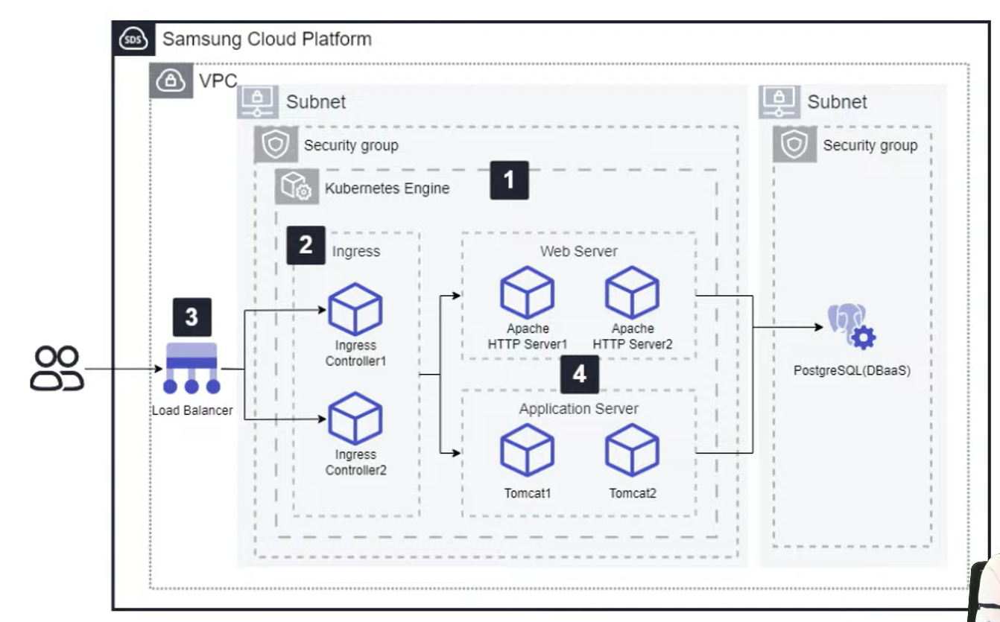
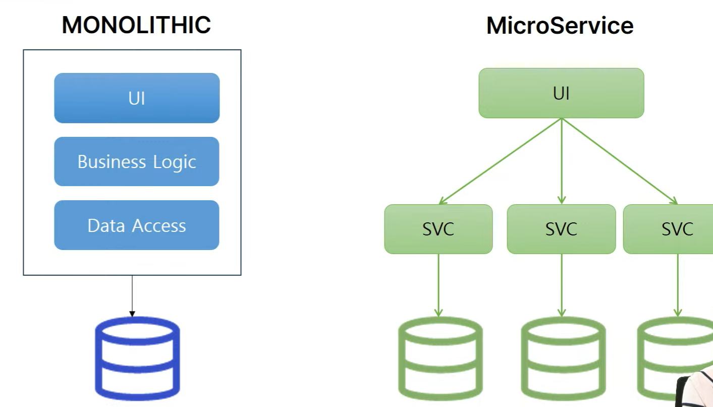
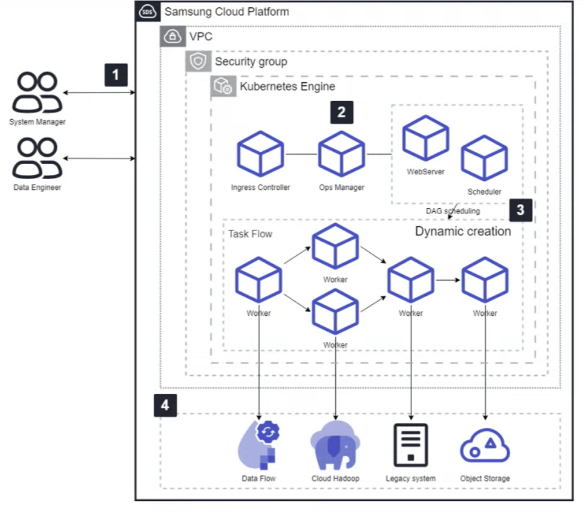
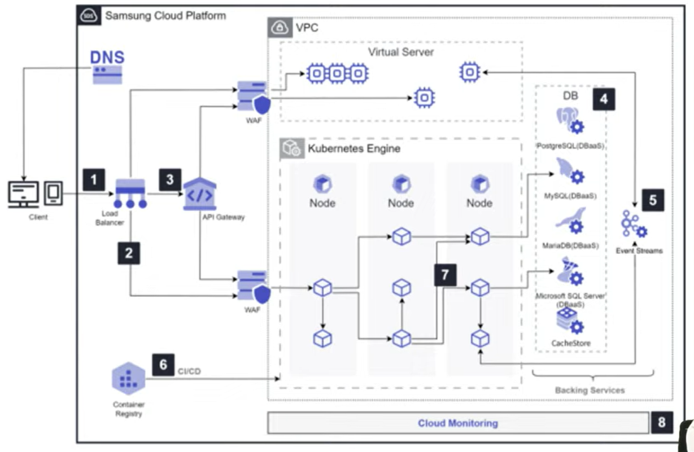

# 개발자가 반드시 알아야 할 클라우드 웹 서비스 아키텍쳐

날짜: 2025년 7월 14일

### Kubernetes란?

한가지 상황을 가정해보자…

→ 신규 서비스를 배포를 하였는데, 이때 트래픽이 한꺼번에 몰리는 상황이 발생하였다.

→ 가장 간단한 방법은 라이브 버추얼 서버를 여러 개 만들고 이것을 로드밸런서를 이용하여 적절하게 서버를 분배를 하는 것이다. 그런데 트래픽의 양이 너무 많아졌다! 그래서 서버를 추가하였지만 이 트래픽이 금방 사그라들었기에 결국 금전적인 손해가 생겼다.

→ 이를 해결하기 위해서 쿠버네티스를 적용하였다. 쿠버네티스를 통해서 ingress와 pod를 생성하였고, load balancer로 이를 분배해주는 작업만을 진행하였다. 그 결과 트래픽이 몰리는 경우에는 pod가 많이 생겨 이를 분배하였고, 트래픽이 별로 없는 시기에는 pod를 줄여서 유동적인 서버를 관리할 수 있게 되었다.

- Kubernetes : 수 많은 컨테이너들을 자동으로 관리하는 Container Orchestrator

Container : 실행환경을 의미함(정확히는 어플리케이션, Library, Config …)

이는 3가지 특성을 가진다

- 이식성(Portability) : 어디서든 동일하게 실행이 된다.
- 격리성(Isolation) : 하나의 컨테이너는 독립적으로 다른 컨테이너의 영향없이 안전하게 실행된다.
- 경량성(LightWeight) : 가벼워서 빠르게 실행된다. → OS를 포함하지 않기 때문이다. OS의 실행시간을 고려하면 상당히 빠른 실행이 가능하다.

→ 그렇다면 exe파일은? 컨테이너가 아니다. 그 이유는 exe는 WIndows에서만 실행할 수 있기 때문이다.(이식성 위반)

→ .jar, .war는? 역시 컨테이너가 아니다. jar는 Java가 있어야하고, war는 WAS 서버가 필요하다. 그렇기에 이것을 포함하고 있다면 컨테이너라고 부를 수 있다.

→ 그러면 Dockerfile로 컨테이너는? 만들 수 있다. 구체적인 Dockerfile은 확장자가 없는 독립적인 파일이다.

### Docker - 컨테이너를 생성, 실행, 관리하는 플랫폼

- 경량성(LightWeight) : Host OS 공유, 짧은 시작 시간
- 확장성(Scalability) : 유연한 서비스 규모 조절
- 재현성(Reproducibility) : 동일한 컨테이너를 무한히 생성할 수 있다.

Dockerfile = Docker 이미지 빌드를 위한 청사진

- From : Base 이미지 정의
- COPY : 호스트 > 컨테이너로 파일 복사
- RUN : 의존성 패키지 설치
- CMD : 컨테이너 시작 시 실행될 명령어

- Kubernetes에서는?

→ 컨테이너의 배포/확장/복구 자동화, 무중단 배포, 롤백, 서비스 디스커버리 로드밸런싱, 리소스 최적화, 자동 스케일링, 셀프힐링 등…

### Kubernetes Architecture

→ 쿠버네티스에서 각각의 기능이 분리가 되어있음을 확인가능(하나의 서비스는 하나의 기능만을 수행함. 다시 말해 마이크로서비스)

### 3-Tier Architecture

→ 아마 서비스를 배포할 때 가장 가능성이 높은 배포 형태

- 어플리케이션의 기능을 논리적으로 분리된 세 개의 계층으로 나누어 구성하는 클라이언트-서버 아키텍쳐
- Presentation(주로 FE) → Business/Logic(주로 BE) → DataBase

이렇게 계층으로 분리를 해놓은 이유는? 분리가 되었기에 각 단계를 독립적으로 분리하여 개발할 수 있고, 이는 다시 말해 중간에 에러가 생긴다고 하더라도 이것이 다른 계층으로 전파가 되지 않는다.

→ 그러면 3-Tier Architecture가 최고인가? 아니다. 시간이 지남에 따라서 Business Layer가 거대해진다면 부적절할 수 있다.

→ 쿠버네티스의 철학인 작고 독립된 서비스로 분리하는 것과는 거리가 먼 형태기 때문에 이때는 다른 형태로 배포를 하는 것을 권장

실제 형태 예시(Samsung Cloud Platform)

→ 실제로는 모든 서비스가 VPC 내부에서 배포가 된다.

→ 외부로 노출시키는 영역은 ingress로, 이는 load balancer를 통해서 사용자가 균등하게 배분이 된다.

이후 Web Server와 Application Server를 통해 FE와 BE로 구분이 되었음을 확인할 수 있다.

다만 해당 시스템의 경우 ProstgreSQL의 경우 쿠버네티스 엔진과 별도로 분리가 되어있음도 확인 가능(이게 정답은 아니다!)

### Monolithic vs MSA Architecture

→ 정확히는 3-Tier Architecture는 이 두개의 중간이다.

- Monolithic : 프로그램 자체가 하나로 통합이 되어있는 아키텍쳐. FE와 BE, Data Access를 모두 하나로;;; 다만 SPA로 구성이 되어있는 작은 서비스는 MSA로 분리하기보다 더 적합할 수 있다.
- MSA Architecture : 서비스와 도메인별로 각각을 나눈 형태. 다만 위의 삽화의 경우 각 SVC마다 DB를 가지고 있지만, 실제로는 서비스간 데이터 전달이 있는 경우가 많기 때문에 하나의 통합된 DB를 각각의 서비스가 접근하는 형태로 설계하고 개발하는 경우가 많음

### Microservice Architecture in Kubernetes

### Data Ops Architecture

주기적으로 데이터에 접근하는 로직의 경우 workflow를 만들어서 자동으로 진행하는 형태이다. 이를 확인해보니 다음과 같이 kubernetes 기반으로 구성이 되어있음을 확인할 수 있다.

### Cloud Native?

→ 클라우드의 이점을 최대한 살려서 어플리케이션을 개발, 배포하고 설계하는 모든 철학을 의미한다.

1. 빠른 개발 → 시장이 빠르게 바뀌는만큼 클라우드도 빠르게 바뀐다. 기존의 안정성을 최대한 살리는 방향이 아니라 문제가 발생시 버그와 에러도 빠르게 수정하여 급변하는 시장에 적응하는 것을 목표로한다
2. 유연한 확장성 → 각 서비스별로 유연하게 확장이 되어야한다. 사용자에 따른 규모의 확대와 축소
3. 높은 가용성 → 아이솔레이션으로 서비스가 지속이 되도록 해야한다.
4. 운영 가용성 → 수많은 서비스가 운영이 되기 때문에 배포와 롤백이 자동으로 구성이 되어야한다.