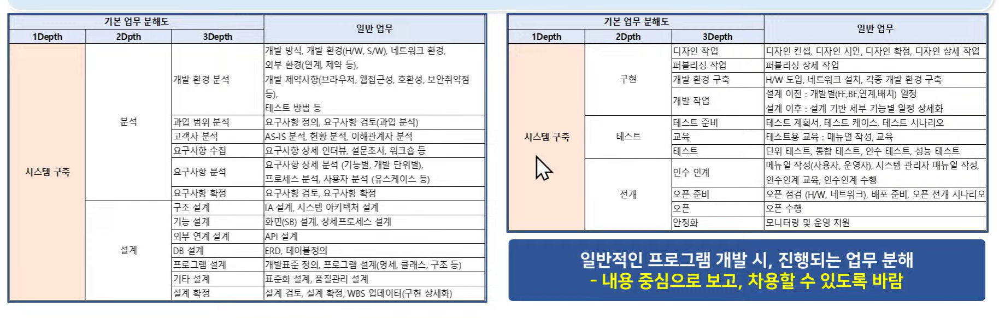

# 3일차 - 특강 AI 시대의 프로젝트 관리

날짜: 2025년 7월 16일

## 프로젝트 기본 관리 방안

갈등 : 현장의 IT 개발 프로젝트에서도 갈등이 많이 발생한다. 중요한 것은 이 갈등은 필연적이기 때문에 이것을 어떻게 효과적으로 해결하는 것인지이다. 

### 프로젝트 기본 관리 방안(IT 현장에서 프로젝트를 관리하는 방안)

- IT 현장에서 프로젝트를 관리하는 방법
    - 프로젝트 진행 계획 후 구성원 역할 분배
    - 역할에 따른 수행 및 진척 관리(by **P**roject **M**anager)
    - 프로젝트 진행 중 발생하는 문제 및 갈등 관리
- IT 현장의 프로젝트 관리
    - IT 현자으이 프로젝트  관리의 컨셉 중 중요한 것이 갈등에 대한 관리이고, 이를 해결하고자 3가지 장치를 가진다.
        1. 방법 → 업무 분배, 역할 분배 & 일정 계획, 보고, 일정 및 변화 관리
        2. 권한 → PM, PL, 권한과 책임을 가진 존재 기반의 관리(싸피에서는 팀장 = PM)
        3. 규칙 → 반복되는 프로젝트 경험을 토대로 예상되는 문제 상황을 최소화

- 방법 관점 관리 : 프로젝트를 업무 방법을 통한 관리로 운영 및 문제 상황을 최소화 하는 과정
    - 업무 분해 / 역할 분배 & 일정 계획 / 보고 / 일정 및 변화 관리
        - 업무 분해 : 프로젝트 진행 과정에 관리 관점에서 업무르 상세하게 분해하는 과정
        
        ( 분석/설계 → 디자인 → 개발 → 테스트 → 오픈 → 안정화)
        
        - 개발을 제외한 나머지 영역, 소통/관리가 필요한 주요 업무 단위까지
        - 개발은 진척을 확인할 수 있는 기준이 되는 최소 단위까지(보통은 화면 단위)
    - 역할 분배 & 일정 계획
        - 업무 분해가 끝난 이후 프로젝트 멤버 간에 각 업무에 대한 역할과 일정 분배
        - 일반적으로는 PM과 PL이 각 멤버를 고려한 1차 업무 분배
        - 1차 업무 분배에 대한 전체 구성원 리뷰
            - 진행에 대한 어려움, 과한 업무, 부족한 업무, 개인 상황에 대한 고려 등
        - 이렇게 조정한다면 일반적인 업무분해로 지연되고 있거나 책임을 회피하는 것에서 벗어나기 어렵다
    - 보고
        - 주간/월간 보고의 정규적 보고를 통한 진행 관리
        - 기본은 PM이 알아서 수행자의 업무를 파악하는 것이 아니라 구성원이 PM에게 자신의 업무를 능동적으로 보고하는 형태
        - PM이 확인하려면 1:N, 그러나 수행자가 보고하는 관점은 1:1이고 필요하다면 구체적이고 정확한 보고를 한다
        - PM은 보고를 통해 발생하는 다양한 문제 해결에 집중(개발 진척 지연, 문제 상황, 갈등 상황’
    - 일정 & 변화 관리
        - 일정에 문제가 생겼을 때 라는 판단이 후 공유가 아님
        - 개인의 판단 과정에서 문제가 생길 수 있다(나는 감당할 수 있을 줄 알았어)
        - 진척된 Fact를 공유하고, PM이 지연/문제에 대한 판단 후 대응
        - 해결은 기본적으로 빠른 처리가 가능한 인원이 늦은 처리를 지원하고 그 결과에서 성과를 배분하는 것
        - 결과르 프로젝트를 해결하고, 성과를 평가로 전환, 평가 결과를 연봉으로 제공
    - WBS 관리
        - WBS라는 문서로 관점의 결과를 정리
    - 권한 관점 관리
        - PM은 상당히 중요하다 → 수적직 권한과 수평적 권한이 있다.
        
        → 그렇다면 수직은 불합리하고 수평을 평등한 문화 아닌가?
        
        → 아니다, 수평이 훨씬 더 많은 관리가 일어난다. 
        

프로젝트 기본 관리 방안

- 규칙 관점 관리 → 반복되는 프로젝트 경험을 토대로 예상되는 문제 상황을 최소화하기 위한 규칙으로 3가지 정도 구분 가능
    - 규정
    - 가이드
    - 문화

### 단기 프로젝트 조직 특성(단기간 진행되는 프로젝트가 갖는 특성에 대한 이해)

- 일반 프로젝트 vs 장기 프로젝트
    - 큰 차이를 가지고 있다
    - 일반적으로는 PM은 프로젝트 관리를 해본 경험이 있으나, 싸피생의 경우 별도의 경험이 없음
    - 강한 강제성 / 약한 강제성
    - 수직적 관계 / 수평적 관계
    - 문제 대응 규칙 존재 / 문제 대응 규칙 부재
    - 강한 평가 영향력 / 약한 평가 영향

### 단기 프로젝트 맞춤형 관리 방안 필요(단기 프로젝트를 위해 맞춤형 관리 방안의 필요성 및 관리 컨셉에 대한 이해)

- 단기 프로젝트에 맞춤형 관리 방안이 필요하다
    - 방법 → 배움을 통해 습득 및 적용
    - 권한 → PM이라는 수직적 인물 기반 권한 대신, 협의된 방법에 권한 부여
    - 규칙 → 발생 가능한 문제를 사전에 찾고, 해당 문제 발생시 대응 방안을 규칙화(SSAFY 그라운드룰의 구체화)

## 프로젝트 문제 해결 방안

ex) 단기 프로젝트 관리 방안

→ 기술 리더 선정 : 팀원들의 투표를 통해 기술력(50%), 소통역량(50%), 다시 말해 기술을 기반으로 원활한 업무 분배가 가능한 사람을 정한다 → 각 팀에 팀장 및 기술 리더에게 기본적인 권한을 부여

단, 실무적인 부분의 분배는 팀장과 기술 리더가 하지만 실제로는 모든 인원과의 협력이 필요하다.

- 생성형 AI의 사용? → AI에 의존하는 것이 아니라 AI가 주는 내용 중 필요한 사항을 체크하는 방법으로 활용시 유용하다.

- 역할 분배 및 일정 계획

→ 팀장 & 기술 리더의 상의를 통한 1차 역할 및 일정 분배

→ 업무 분배 기반 역할 & 일정 계획 자료 팀원 사전 공유 후 검토

→ 1차 역할 및 일정 분배 내역 전체 팀원 리뷰 후 확정

→ 확정된 역할&일정에 대한 전체 구성원의 확인(결과물에 대한 이메일 공유 후 전체 회신)

→ 이후 각 팀원은 전체 분배 대역을 사전 리뷰하여 의견을 가지고 올 것

→ 역할에 대한 의견 : 이것을 하고 싶다, 이것이 어렵다 / 범위에 대한 의견 : 이것은 무리이다, 더 많은 범위를 하고 싶다

→ 중요 : 각 구성원 위험 요소 스스로 사전 공유 : 취업 준비, 개인 사정 등(구체적 날짜, 상황, 참여도 기반) 해당 사항을 고려한 리뷰

→ 이때 자율 협의를 기본으로 하되, 만약에 충돌의견이 발생했을 경우에는 팀장과 개발리더의 결정하에 주도한다.

→ 최종 업무 결과 기준 팀장과 개발리더가 각 팀원의 목표 기여도 수치화 정리

→ 나중에 실제로 이를 관리하면서 최종 기여도를 확정

- 보고

→ 관리의 기본은 팀장 및 개발 리더가 진척이나 문제 상황을 파악해야하는 것이 아니라 개별 구성원이 진척 상황, 문제 상황, 변경 사항 등을 공유하는 것임을 인지해야함

→ 즉 파악 못한 누군가가 있는 것이 아니라, 공유하지 않은 누군가가 있는 형태

→ 보고는 형식이 아니라 실질적이어야한다.

→ 기본은 주간이지만, 기간이 짧은 만큼 데일리 스크럼을 활용

ex)

일정 진척 지연 여부 → Y or N(목표 *%, 수행 *%)

진행 이슈 → 진행 중 어려움, 이슈, 상의 필요 사항 공유

변경 사항 → 진행 중 변경된 내용 혹은 변경 필요 사항

지원 요청 → 진행 중 도움이 필요한 상황

- 일정 및 변화 관리

→ 기록이 없는 일정과 변화는 없다

→ 팀장과 개발리더는 현재 사용하는 관리 툴을 이용하여 작업 진척 파악과 변경 사항이 파악이 가능하도록 구성

→ 각 멤버는 데일리 스크럼 이전까지 자신의 진척 상황과 변경 사항을 명확히 기입한다

→ 팀장은 작성된 진척 상황 및 변경 사항을 매일 명확히 파악한다

→ 팀장은 사전 파악된 진척 상황 및 변경사항과 데일리 스크럼 보고를 통한 진척 관리

→ 일정 및 변화가 이상이 없을 경우 빠른 종료

→ 일정 및 변화 이상이 있는 경우, 이슈 확인 정리

→ 팀장은 자신 품질 관리 수행 (보고의 내용과 실제 진행에 대한 직접 확인, 이러한 이유로 팀장이 업무 일부를 조정해주는 것 필요)

- 권한

→ 권한은 규칙으로 정의되지않는 예외적인 문제가 발생시 해결하는 방법이다 → IT 현장에서는 PM이 하는 일

→ 단기 프로젝트에서는 팀장과 기술리더가 그 권한을 갖기는 어렵기 때문에 이 상황에서는 권한이 아닌 모두가 협의 후 해결할 일으로 규정해야한다

→ 갈등이 발생하기 전에 사전 약속을 하는 것

→ 만약 규칙 외의 갈등이 발생한다면 우리는 이런 규칙을 통해 해결하자라고 갈등이 발생하기 전에 사전 약속을 하는 것

ex) 팀장에게 PM 수준의 권한을 주자, 팀장과 기술 리더의 협의를 통해 결정하자, 다수결을 쓰자

→ 즉 권한을 조직에서 부여하는 것이 아니라 해당 팀의 상황에 구성 멤버간의 협의를 통해 만들어내는 것

→ 중요한것은, 이렇게 약속된 권한을 팀원 모두가 반드시 지키자는 단단한 약속이 문제가 발생이 되기 전에 수립되는 것이 중요하다

- 규칙

→ 자주 발생하는 사례 기반 사전 대응 방안을 세우는 것

→ 기본은 문제가 발생한 우헤는 각자의 이해관계가 생성, 그 이후 대응은 갈등으로 시작함

→ 핵심으로 문제 발생 전에 각자의 이해관계가 없는 편안한 상황에서 규칙을 세우는 것이 핵심이다.(SSAFY 그라운드룰에 이러한 규칙을 추가)

→ 일반적인 단기 프로젝트 조직과  SSAFY 프로젝트라도 기존 갈등 요소를 분석하는 것이 중요

### 주요 발생 문제

1. 진척의 지연 → 팀원 중 누군가의 진척이 지연이 된다면? 방법 중 보고 및 일정 변화 관리를 통해서 해결
2. 정보의 공유 → 공유해야 할 정보를 서로 공유하지 않아 생기는 문제? 방법 중 보고를 통해 해결
3. 의견의 차이 → 특정 안건을 두고 다른 의견이 강하게 부딪히는 경우? 권한을 통해서 해결
4. 역할의 분담 → 분담된 역할에 분만을 가진다면? 방법 중 역할 분배 및 일정 계획을 통해 해결
5. 품질의 저하 → 작업을 하였으나, 내용의 불성실로 상호 불만이 생긴다면? 방법 중 보고 및 일정 변화 관리를 통해 해결
6. 의욕의 차이 → 더 많은 하고 싶은 사람과 더 적게 하고 싶은 사람으로 인한 갈등
7. 역량의 차이 → 개발 기술의 역량이 높은 사람과 낮은 사람간의 갈등
8. 책임의 부재 → 약속된 업무 수행을 못하는 사람 혹은 이탈하는 사람 발생
9. 관계의 문제 → 팀원간 사이가 나빠지기 시작한 상황
10. 표현의 문제 → 멤버간 표현방식의 차이로 인한 감정 싸움

### 의욕의 차이?

→ 최소치와 최대치로 구분되도록 업무를 분해

→ 최소치 : 모든 멤버가 최소 여기까지 작업하는 것에는 이의 없음의 범위 / 최대치 : 의욕적 멤버가 제안하는 작업 범위

→ 전체 일정은 최소치에 맞춘다

→ 최소치는 의무, 최대치는 자율이다. 최대치로 한 멤버에게는 보상을 부여한다.

### 역량의 차이?

→ 지식이 높은 사람은 배려, 지식이 낮은 사람은 존중을 기본으로 한다

→ 역량이 높은 사람이 많은 업무를 할 것인가? 아니면 동등한 업무 분배를 할 것인가?

→ 이를 팀원 내 배려를 기본으로 최초 일정 계획시 협의

→ 단, 많은 업무를 수행한 사람에 상호역량평가시 고득점을 준다

### 책임의 부재?

→ 진행 중 개인 사정으로 이탈 혹은 부재 상황 발생시

→ 이 경우에 본인 역할을 수행하게 하는 것이 아니라 어쩔 수 없이 해당 상황이 발생시 빨리 공유하고 대응하도록 한다

→ 문제가 예상 되는 경우 최소한의 예를 지키면서 상황을 가능한 한 빨리 공유한다

→ 팀은 해당 상황 발생시, 이탈 인원의 역할을 배분하는 규칙을 사전에 정하고 규칙대로 수행, 팀원 의견 반영의 범위, 회의 참여, 개발 외 역할 참여 등 규칙을 구체적으로 정의할수록 유리

### 관계의 문제?

→ 다양한 사람이 모여 수행 중 갈등이 생기는 것은 자연스럽다

→ 갈등 발생시 갈등 대상이 직접적인 표현은 자제한다

→ 발생 시 팀원 누구든지 빠르게 코치에게 중재 요청을 한다

→ 코치에게 상의하고 코치의 조정방향을 따른다

### 표현의 문제?

→ 사전에 표현 문제 중재자 결정

→ 기본적으로 중재자가 다양한 미팅 가운데 보이는 조심해야할 표현에 대한 감지 및 대응

→ 중재자는 절대 서로의 앞(1:N, N:N) 상황에 특정인의 표현에 대한 중재를 하면 안된다. 반드시 철저하게 1:1 상황에서 의견 전달을 해줘야한다

→ 이때 누가 의견을 줬는지는 말하지말고 내용만 소통한다

### 가장 중요한 규칙

→ 가장 중요한 것은 존중이다.

→ 모든 규칙은 서로를 존중하는 것에서 나온다

→ 누군가가 나쁘기 보다는 서로가 다름에 익숙하지 않아서 발생하는 문제이다.